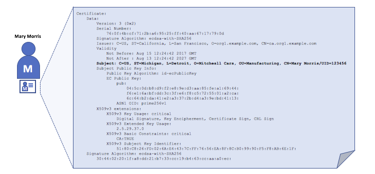
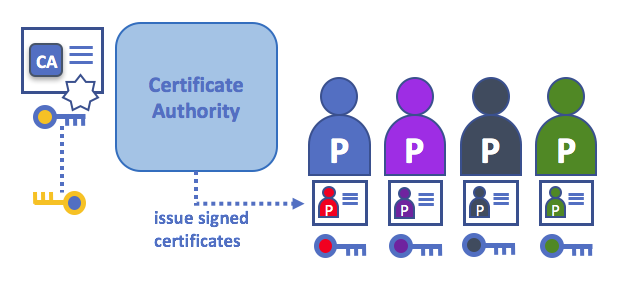

# 身份

## 身份是什么？

区块链网络中的不同角色包括peers、orderers、client applications、administrators等等。
这些参与者中的每一个（能够使用服务的网络内部或外部的活动元素）都具有封装在X.509数字证书中的数字身份。
这些身份真的很重要，因为它们**决定了参与者在区块链网络中对资源和信息的访问的确切权限**。

此外，数字身份（digital identity）还具有一些额外的属性，Fabric使用该属性来确定权限，
并且它为身份和相关属性的联合提供了特殊的名称--- **principal**。
principal就像userID或groupID，但是稍微灵活一些，因为它们可以包括参与者身份的各种属性，
例如参与者的组织、组织单元、角色甚至参与者的特定身份。
当我们谈论principal时，它们是决定其权限的属性。

身份如果要 **可验证**，它就必须来自**可信的**权威。
[成员服务提供商](../membership/membership.html) (MSP) 就是Fabric实现这个的机制。
更具体地说，MSP是定义管理该组织的有效身份的规则的组件。
结构中的默认MSP实现使用X.509证书作为身份，采用传统的公钥基础设施（PKI）分层模型（稍后在PKI上会作更多阐述）。

## 一个解释身份使用的简单场景

想象一下你去超市买一些杂货。在结帐处你看到一张牌子，上面写着只接受Visa、Mastercard和AMEX。
如果你尝试用其他的卡付账 --- 我们称之为“想象卡” --- 不管卡是否真实，你的账户里是否有足够的资金。
它都是不被接受的。

*有一个有效的信用卡是不够的，它也必须被商店接受才行！
PKI和MSP以相同的方式一起工作，PKI提供身份列表，MSP指出这些身份中的哪些是参与网络的特定组织的成员。*

PKI证书颁发机构和MSP提供了类似的功能组合。
PKI就像一个卡提供商，它提供了许多不同类型的可验证的身份。
另一方面，MSP类似于商店接受的卡提供商列表，确定哪些身份是商店支付网络的可信成员（参与者）。
**MSP将可验证的身份转换成区块链网络的成员。**

让我们更详细地钻研这些概念。

## PKI是干什么的？

**公钥基础设施（PKI）是在网络中提供安全通信的互联网技术的集合。**
是PKI将 **S** 放入了 **HTTPS**，如果您正在Web浏览器上阅读本文档，那么您可能正在使用PKI来确保它来自一个经过验证的源。

*公钥基础设施（PKI）的要素。
PKI由证书颁发机构组成，证书颁发机构向各方（例如，服务的用户、服务提供者）颁发数字证书，
然后各方使用证书在与其环境交换的消息中验证自己。
CA证书吊销列表（CRL）构成不再有效的证书的引用。
由于许多原因，证书的撤销可能发生。
例如，证书可能被撤销，因为与证书相关联的加密私有材料已经被公开。*

虽然区块链网络不仅仅是一个通信网络，但是它依赖于PKI标准来确保各种网络参与者之间的安全通信，
并确保发送到在区块链链上的消息被正确地认证。
因此，了解PKI的基础知识，然后了解MSP为什么如此重要是非常重要的。

PKI有四个关键要素：

 * **数字证书**
 * **公钥和私钥**
 * **证书颁发机构s**
 * **证书吊销列表**

让我们快速地描述这些PKI基础知识，如果你想知道更多的细节，
[Wikipedia](https://en.wikipedia.org/wiki/Public_key_infrastructure) 是一个很好的开始。

## 数字证书

数字证书是一个文档，其包含了与证书持有者相关的一组属性。
最常见的证书类型是符合 [X.509 standard](https://en.wikipedia.org/wiki/X.509) 标准的证书，
该标准允许对当事人身份细节进行结构化的编码。

例如，密歇根州 底特律 米歇尔汽车制造部 的玛丽·莫里斯可能有一个 `SUBJECT` 属性为
`C=US`,`ST=Michigan`, `L=Detroit`, `O=Mitchell Cars`, `OU=Manufacturing`, `CN=Mary Morris /UID=123456` 
的数字证书。
玛丽的证书与她的政府身份证相似，它提供了关于玛丽的信息，她可以用来证明关于她的重要事实。
X.509证书中还有很多其他属性，但现在我们只关注上面提到的这些。

*一个描述叫做Mary Morris的身份的数字证书。玛丽是证书的 `SUBJECT` ，
突出的 `SUBJECT` 文本显示了关于玛丽的关键事实。
如您所见，该证书还保存了更多的信息。
最重要的是，玛丽的公钥是在她的证书中分发的，而她的私有签名密钥不是。
这个签名密钥必须保密。*

重要的是，可以使用称为加密（cryptography：字面意思是“*秘密写入*”）的数学技术记录Mary的所有属性，以便防止篡改行为造成证书失效。
只要对方信任证书颁发者（称为**证书颁发机构**（CA）），加密允许Mary向其他人提交证书以证明她的身份。
只要CA安全地保存某些加密信息（即它自己的**私有签名密钥**），任何阅读证书的人都可以确保关于Mary的信息没有被篡。
对于Mary Morris，它总是具有那些特定的属性。可以把玛丽的X.509证书看作是不可能改变的数字身份证。

## 身份验证、公钥和私钥

认证和消息完整性是安全通信中的重要概念。
身份验证要求，交换消息的各方保证有创建特定消息的身份。
对于具有“完整性”的消息，意味着在传输过程中不能修改。
例如，您可能希望确保与真实的Mary Morris通信，而不是冒充者。
或者，如果Mary已经向您发送了消息，您可能希望确保在传输过程中没有其他人篡改它。

传统的认证机制依赖于**数字签名（digital signatures）**，顾名思义，数字签名允许一方对其消息进行数字化的**签名**。
数字签名还提供了签名消息完整性的保证。

从技术上讲，数字签名机制要求每一方持有两个加密连接的密钥：一个公钥，它被广泛使用并作为认证锚；
还有一个私钥，用于在消息上生成**数字签名**。
数字签名消息的接收者，可以通过检查所附的名在预期发送者的公钥下是否有效，从而来验证所接收消息的来源和完整性。

**私钥与各自的公钥之间的独特关系是使安全通信成为可能的密码魔法。**
密钥之间的唯一数学关系，使得私钥可以用于在只有相应的公钥可以匹配的消息上生成签名，并且仅在相同的消息上生成签名。

在上面的示例中，玛丽使用她的私钥来签署消息。任何看到消息的人，都可以使用她的公钥对签名进行验证。

证书颁发机构将证书分发给不同的参与者。这些证书由CA进行数字签名，并将参与者与参与者的公钥（可选地还有一个全面的属性列表）绑定在一起。因此，如果信任CA（并且知道其公钥），则通过验证参与者证书上的CA签名，可以信任特定参与者绑定到证书中包括的公钥，并拥有所包括的属性。证书可以广泛传播，因为它们既不包括演员也不包括CA的私钥。因此，它们可以用作信任来自不同行动者的消息的信任锚。CAs也有证书，他们广泛使用。这允许给定CA颁发的身份的消费者通过检查证书是否只能由相应的私钥（CA）的持有者生成，来验证它们。在块链设置中，希望与网络交互的每个演员都需要身份。在此设置中，您可能会说，可以使用一个或多个CA从数字角度定义组织的成员。正是CA为一个组织的参与者提供了一个可验证的数字身份的基础。

## 证书颁发机构

如您所见，参与者或节点能够通过系统信任的权威机构为其发布的**数字身份**，来参与块链网络。
在最常见的情况下，数字身份（或简称，**身份**）具有符合X.509标准的加密验证的数字证书的形式，并且由证书颁发机构（CA）颁发。

CA是互联网安全协议的一个常见部分，您可能已经听说过一些比较流行的协议：
赛门铁克（最初是Verisign）、GeoTrust、DigiCert、GoDaddy和Comodo等等。

*证书颁发机构将证书分发给不同的参与者。这些证书由CA进行数字签名，并将参与者与参与者的公钥（可选地还有一个全面的属性列表）绑定在一起。
因此，如果信任CA（并且知道其公钥），通过验证行动者证书上的CA签名，就可以相信：特定参与者绑定了证书中包括的公钥，并拥有所包括的属性。*

证书可以广泛传播，因为它们既不包括行动者也不包括CA的私钥。
因此，它们可以作为一个信任锚点，从而信任来自不同行动者的消息。

CA也有证书，他们广泛使用。
这允许参与者在验证特定CA颁发的身份时，可以通过检查证书是否只能由相应的私钥（CA）的持有者生成，从而达成验证。

在区块链设置中，希望与网络交互的每个行动者都需要身份。
在此设置中，您可能会说，可以使用 **一个或多个CA** 来 **从数字角度定义组织的成员**。
正是CA为一个组织的参与者提供了一个可验证的数字身份的基础。

### 根CA、中间CAs和信任链

CA有两种形式：**根CA** 和 **中间CA**。
因为根CA（Symantec、Geotrust等）必须**安全地**向互联网用户分发数以亿计的证书，所以将这个过程扩展到所谓的中间CA是有意义的。
这些 **中间CA** 具有由根CA或其他中间机构颁发的证书，允许为链中的任何CA颁发的任何证书建立“信任链”。
追溯到根CA的这种能力不仅允许CA的功能进行扩展，同时仍然提供安全性（允许使用证书的组织有信心地使用中间CA）还限制了根CA的暴露，
如果根CA受到损害，这将危及到整个信任链。另一方面，如果只是中间CA被破坏，将有一个稍小的曝光。

*在根CA和一组中间CA之间建立信任链，只要满足这样的条件，即：
每个为这些中间CA颁发证书的CA，都是根CA本身或者具有对根CA的信任链。*

中间CA在跨多个组织颁发证书时提供了大量的灵活性，这对于允许的区块链系统（如Fabric）非常有帮助。
例如，您将看到不同的组织可以使用不同的根CA，或者使用具有不同中间CA的相同根CA——这确实取决于网络的需要。

### Fabric CA

正是因为CA非常重要，所以Fabric提供了一个内置的CA组件，允许您在您所创建的区块链网络中创建CA。
这个称为 **Fabric CA** 的组件是一个私有根CA提供者，能够管理具有X.509证书形式的Fabric参与者的数字身份。
因为Fabric CA是针对Fabric的根CA需求的定制CA，所以它固有地不能为浏览器中的 通用/自动 使用提供SSL证书。
然而，因为必须使用 **一些** CA来管理身份（即使在测试环境中），所以可以使用Fabric CA来提供和管理证书。
使用公共/商业根或中间CA来提供身份证明也是可能的，也是完全合适的。

如果你感兴趣，你可以在
[in the CA documentation section](http://hyperledger-fabric-ca.readthedocs.io/)
部分阅读更多关于Fabric CA的内容。

## 证书吊销列表

证书吊销列表（Certificate Revocation List，CRL）很容易理解，它只是CA知道的，由于某种原因而被撤销的证书的引用列表。
如果你回忆起商店的例子，CRL就像是被盗信用卡的列表。

当第三方想要验证另一方的身份时，它首先检查发行的CA的CRL，以确保证书没有被撤销。
验证者不必非得检查CRL，但如果他们不检查，则要承担受损身份的风险。

*使用CRL检查证书是否仍然有效。
如果模拟器试图将受损的数字证书传递给验证方，那么可以首先根据发行的CA的CRL对其进行检查，以确保它不再被列为无效的。*

请注意，吊销证书与证书过期非常不同。吊销证书没有过期，它们是有效的证书。
有关CRLs的更深入的信息，请点击[这里](https://hyperledger-fabric-ca.readthedocs.io/en/latest/users-guide.html#generating-a-crl-certificate-revocation-list).

现在，您已经看到PKI如何通过信任链提供可验证的身份了，下一步是看这些身份如何被用来表示区块链网络的可信成员。
这就是会员服务提供商（MSP）发挥作用的地方，**它表明了区块链网络中给定组织成员的当事人身份**。

要了解有关成员资格的更多信息，请查看关于[MSP](../membership/membership.html)的概念文档。

<!---
Licensed under Creative Commons Attribution 4.0 International License https://creativecommons.org/licenses/by/4.0/
-->
