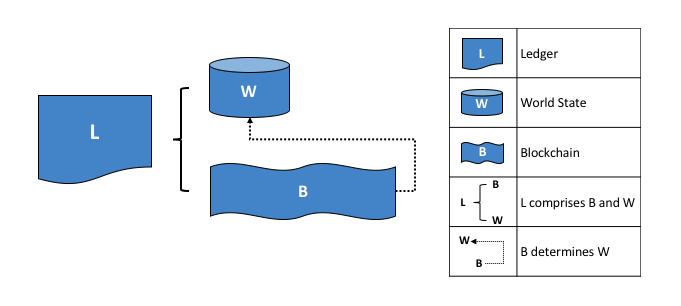

# 账本

## 账本是什么?

石质分类账——但是让我们从一个更新的例子开始！你可能习惯于每月查看你的银行账户。对你来说最重要的是可用的平衡——这就是你能在当前时刻花费的东西。如果你想知道你的余额是如何得出的，那么你可以通过交易信用和借方来确定。这是一个分类账的现实例子——一个状态（您的银行余额）和一组确定它的有序交易（贷方和借方）。Hyperledger Fabric的动机来自这两个相同的关注点——呈现一组分类账状态的当前值，并捕获确定这些状态的事务的历史。让我们仔细看看超分类帐分类帐结构！

账本包含业务的当前状态，可作为交易日志。
最早的欧洲和中国账本可以追溯到将近1000年前，
而苏美尔人4000年前就有了
[石质账本](http://www.sciencephoto.com/media/686227/view/accounting-ledger-sumerian-cuneiform)。
但是让我们从一个更新的例子开始吧！

你可能习惯于每月查看你的银行账户。
对你来说最重要的是可用的平衡，这就是你能在当前时刻花费的东西。
如果你想知道你的余额是如何得出的，那么你可以通过交易信用和借方来确定。
这是一个账本的现实例子——一个状态（您的银行余额）和一组确定它的有序交易（贷方和借方）。
Hyperledger Fabric的动机来自这两个相同的关注点——呈现一组账本状态的当前值，并捕获确定这些状态的交易的历史。

让我们仔细看看Hyperledger Fabric账本结构！

## 区块链账本

区块链账本由两个截然不同的部分组成，一个是世界状态（world state），另一个是区块链。

首先，有一个**世界状态**，一个保存一组账本状态**当前值**的数据库。
世界状态使得程序很容易获得这些状态的当前值，而不必通过遍历整个交易日志来计算它们。
默认情况下，账本账状态被表示为**键-值**对，不过稍后我们将看到Hyperledger Fabric在这方面提供了灵活性。
随着状态可以被创造、更新和删除，世界状态可以频繁改变。

其次，有一个**区块链**，一个记录所有决定世界状态的变化的交易日志。
交易被收集在附加到块链的块中，使您能够理解导致当前世界状态的更改的历史。
区块链数据结构与世界状态非常不同，因为一旦写入，它就不能被修改。
它是一个**不可变**i的区块序列，每个块包含一组有序交易。

*上面看到的东西表述的事情如下：账本L包括区块链B和世界状态W。区块链B确定世界状态W。*

在一个Hyperledger Fabric网络中有一个**逻辑**账本是有帮助的。
实际上，网络维护着一个账本的多个副本，通过一个叫做**共识**的过程，它与每一个副本保持一致。
**分布式账本技术**（**DLT**）一词通常与这种账本相关联，它是逻辑上单一的，但在网络中分布有许多一致的拷贝。

现在让我们更详细地检查世界状态和区块链数据结构。

## 世界状态

世界状态代表所有分类帐状态的当前值。
这是非常有用的，因为程序通常需要一个分类帐状态的当前值，而且总是很容易得到。
您不需要遍历整个区块链来计算任何分类账状态的当前值，您只需直接从世界状态获取它。

*上面看到的东西表述的事情如下：*有一个 key＝CAR1和 value＝Audi 的分类帐状态。
有一个具有 key＝CAR2 的分类帐状态，它和一个更复杂的值{model:BMW, color=red, owner=Jane}。两个状态都在版本0。*

分类帐状态被用来记录通过区块链共享的应用程序信息。上面的例子显示了两辆车CAR1和CAR2的分类帐状态。
你可以看到状态有一个键和一个值。您的应用程序调用链码，该链码通过简单的API访问状态 -- 
它们使用状态键**get**, **put** 和 **delete**状态。
请注意，状态值可以是简单的(Audi...)或复杂的(type:BMW...)。

从物理上讲，世界状态是用数据库形式实现的。
这是非常有意义的，因为数据库提供了一组丰富的操作符来高效地存储和检索状态。
稍后我们将看到，Hyperledger Fabric可以被配置，使用不同的世界状态数据库来满足不同类型的状态值的需要，和应用程序所需的访问模式，例如在复杂查询中。

交易捕获到世界状态的变化，正如您所期望的，交易具有生命周期。它们是由应用程序创建的，并最终被提交到账本区块链。
[这里](../txflow.html) 将详细描述整个生命周期；
但是Hyperledger Fabric的关键设计点是，只有由一组 **背书组织** **签名** 的交易才会导致对世界状态的更新。
如果交易没有由足够的背书人签名，那么它将无法通过有效性检查，并且不会导致世界状态的更新。

您还会注意到，一个状态有一个版本号，在上面的图中，状态CAR1和CAR2处于它们的初始版本0。
每当状态改变时，状态的版本号就会递增。当状态被更新时也检查它，以确保它在创建交易时与版本匹配。
该检查确保世界状态**从与创建交易相同的期望值更改为相同的期望值**。

最后，当创建一个分类帐时，世界状态是空的。
因为表示对世界状态的有效更改的任何交易都记录在块链上，这意味着可以在任何时候从区块链重新生成世界状态。
这可以非常方便——例如，当创建peer时，自动生成世界状态。
此外，如果peer异常失败，peer重启时可以在接受交易之前重新生成世界状态。

## Blockchain

Let's now turn our attention from the ledger world state to the ledger
blockchain.

The blockchain is a transaction log, structured as interlinked blocks, where
each block contains a sequence of transactions, each of which represents a query
or update to the world state. The exact mechanism by which transactions are
ordered is discussed [elsewhere](../peers/peers.html#peers-and-orderers) --
what's important is that block sequencing, as well as transaction sequencing
within blocks, is established when blocks are first created.

Each block's header includes a hash of the block's transactions, as well a copy
of the hash of the prior block's header. In this way, all transactions on the
ledger are sequenced and cryptographically linked together. This hashing and
linking makes the ledger data very secure. Even if one node hosting the ledger
was tampered with, it would not be able to convince all the other nodes that it
has the 'correct' blockchain because the ledger is distributed throughout a
network of independent nodes.

Physically, the blockchain is always implemented as a file, in contrast to the
world state, which uses a database. This is a sensible design choice as the
blockchain data structure is heavily biased towards a very small set of simple
operations. Appending to the end of the blockchain is the primary operation, and
query is currently a relatively infrequent operation.

Let's have a look at the structure of a blockchain in a little more detail.

*The visual vocabulary expressed in facts is as follows: Blockchain B
contains blocks B0, B1, B2, B3. B0 is the first block in the blockchain, the
genesis block*

In the above diagram, we can see that **block** B2 has a **block data** D2 which
contains all its transactions: T5, T6, T7.

Most importantly, B2 has a **block header** H2, which contains a cryptographic
**hash** of all the transactions in D2 as well as with the equivalent hash from
the previous block B1. In this way, blocks are inextricably and immutably linked
to each other, which the term **blockchain** so neatly captures!

Finally, as you can see in the diagram, the first block in the blockchain is
called the **genesis block**.  It's the starting point for the ledger, though it
does not contain any user transactions. Instead, it contains a configuration
transaction containing the initial state of the network channel (not shown). We
discuss the genesis block in more detail when we discuss the blockchain network
and [channels](../channels.html) in the documentation.

## Blocks

Let's have a closer look at the structure of a block. It consists of three
sections

* **Block Header**

  This section comprises three fields, written when a block is created.

  * **Block number**: An integer starting at 0 (the genesis block), and
  increased by 1 for every new block appended to the blockchain.

  * **Current Block Hash**: The hash of all the transactions contained in the
  current block.

  * **Previous Block Hash**: A copy of the hash from the previous block in the
  blockchain.

  

  *The visual vocabulary expressed in facts is as follows: Block header H2 of
  block B2 consists of block number 2, the hash CH2 of the current block data
  D2, and a copy of a hash PH1 from the previous block, block number 1.*

* **Block Data**

  This section contains a list of transactions arranged in order. It is
  written when the block is created. These transactions have a rich but
  straightforward structure, which we describe [later](#Transactions) in this
  topic.

* **Block Metadata**

  This section contains the time when the block was written, as well as the
  certificate, public key and signature of the block writer. Subsequently, the
  block committer also adds a valid/invalid indicator for every transaction,
  though this information is not included in the hash, as that is created when
  the block is created.

## Transactions

As we've seen, a transaction captures changes to the world state. Let's have a
look at the detailed **blockdata** structure which contains the transactions in
a block.

*The visual vocabulary expressed in facts is as follows: Transaction T4 in
blockdata D1 of block B1 consists of transaction header, H4, a transaction
signature, S4, a transaction proposal P4, a transaction response, R4, and a list
of endorsements, E4.*

In the above example, we can see the following fields:

* **Header**

  This section, illustrated by H4, captures some essential metadata about the
  transaction -- for example, the name of the relevant chaincode, and its
  version.

* **Signature**

  This section, illustrated by S4, contains a cryptographic signature, created by
  the client application. This field is used to check that the transaction
  details have not been tampered with, as it requires the application's private
  key to generate it.

* **Proposal**

  This field, illustrated by P4, encodes the input parameters supplied by an
  application to the chaincode which creates the proposed ledger update. When
  the chaincode runs, this proposal provides a set of input parameters, which,
  in combination with the current world state, determines the new world state.

* **Response**

  This section, illustrated by R4, captures the before and after values of the
  world state, as a **Read Write set** (RW-set). It's the output of a chaincode,
  and if the transaction is successfully validated, it will be applied to the
  ledger to update the world state.

* **Endorsements**

  As shown in E4, this is a list of signed transaction responses from each
  required organization sufficient to satisfy the endorsement policy. You'll
  notice that, whereas only one transaction response is included in the
  transaction, there are multiple endorsements. That's because each endorsement
  effectively encodes its organization's particular transaction response --
  meaning that there's no need to include any transaction response that doesn't
  match sufficient endorsements as it will be rejected as invalid, and not
  update the world state.

That concludes the major fields of the transaction -- there are others, but
these are the essential ones that you need to understand to have a solid
understanding of the ledger data structure.

## World State database options

The world state is physically implemented as a database, to provide simple and
efficient storage and retrieval of ledger states. As we've seen, ledger states
can have simple or complex values, and to accommodate this, the world state
database implementation can vary, allowing these values to be efficiently
implemented. Options for the world state database currently include LevelDB and
CouchDB.

LevelDB is the default and is particularly appropriate when ledger states are
simple key-value pairs. A LevelDB database is closely co-located with a network
node -- it is embedded within the same operating system process.

CouchDB is a particularly appropriate choice when ledger states are structured
as JSON documents because CouchDB supports the rich queries and update of richer
data types often found in business transactions. Implementation-wise, CouchDB
runs in a separate operating system process, but there is still a 1:1 relation
between a network node and a CouchDB instance. All of this is invisible to
chaincode. See [CouchDB as the StateDatabase](../couchdb_as_state_database.html)
for more information on CouchDB.

In LevelDB and CouchDB, we see an important aspect of Hyperledger Fabric -- it is
*pluggable*. The world state database could be a relational data store, or a
graph store, or a temporal database.  This provides great flexibility in the
types of ledger states that can be efficiently accessed, allowing Hyperledger
Fabric to address many different types of problems.

## Example Ledger: fabcar

As we end this topic on the ledger, let's have a look at a sample ledger. If
you've run the [fabcar sample application](../write_first_app.html), then you've
created this ledger.

The fabcar sample app creates a set of 10 cars, of different color, make, model
and owner. Here's what the ledger looks like after the first four cars have been
created.

*The visual vocabulary expressed in facts is as follows: The ledger L, comprises
a world state, W and a blockchain, B. W contains four states with keys: CAR1,
CAR2, CAR3 and CAR4. B contains two blocks, 0 and 1. Block 1 contains four
transactions: T1, T2, T3, T4.*

We can see that the ledger world state contains states that correspond to CAR0,
CAR1, CAR2 and CAR3. CAR0 has a value which indicates that it is a blue Toyota
Prius, owned by Tomoko, and we can see similar states and values for the other
cars. Moreover, we can see that all car states are at version number 0,
indicating that this is their starting version number -- they have not been
updated since they were created.

We can also see that the ledger blockchain contains two blocks.  Block 0 is the
genesis block, though it does not contain any transactions that relate to cars.
Block 1 however, contains transactions T1, T2, T3, T4 and these correspond to
transactions that created the initial states for CAR0 to CAR3 in the world
state. We can see that block 1 is linked to block 0.

We have not shown the other fields in the blocks or transactions, specifically
headers and hashes.  If you're interested in the precise details of these, you
will find a dedicated reference topic elsewhere in the documentation. It gives
you a fully worked example of an entire block with its transactions in glorious
detail -- but for now, you have achieved a solid conceptual understanding of a
Hyperledger Fabric ledger. Well done!

## More information

See the [Transaction Flow](../txflow.html),
[Read-Write set semantics](../readwrite.html) and
[CouchDB as the StateDatabase](../couchdb_as_state_database.html) topics for a
deeper dive on transaction flow, concurrency control, and the world state
database.

<!--- Licensed under Creative Commons Attribution 4.0 International License
https://creativecommons.org/licenses/by/4.0/ -->
