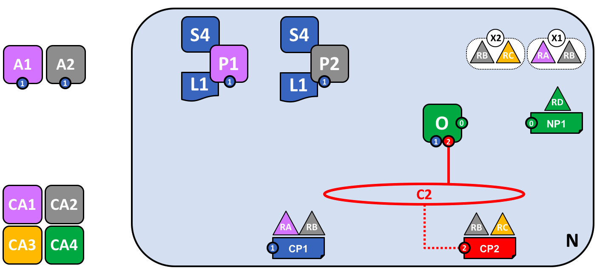
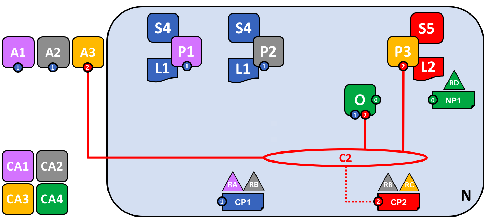

# Hyperledger Fabric 网络

## 什么是 Fabric Network?

允许Fabric的区块链网络是一种技术基础设施，它为应用程序使用者和管理员提供分类账服务。
在大多数情况下，多个 [organizations](../glossary.html#organization) 
联合起来作为一个联盟 [consortium](../glossary.html#consortium)组成网络，
它们的权限由联盟最初配置网络时同意的一组 [policies](../glossary.html#policy) 决定。
此外，网络政策可以随着时间的推移，根据联盟中的组织的同意改变。

本文档将带您了解组织配置和部署Hyperledger Fabric网络，形成网络内事务的通道，
以及如何在网络生命周期内更新这些决策所需的决策。
您还将了解如何将这些决策嵌入到Hyperledger Fabric的体系结构和组件中。

## 谁应该读这个？

在本主题中，我们将重点讨论网络的主要组成部分，它们为什么存在以及何时使用它们。
本主题是针对区块链架构师和区块链网络管理员的。区块链应用程序开发人员也可能感兴趣。
由于这是概念性文档，如果您想深入了解技术细节，我们鼓励您查看本网站上可用的技术文档。

## 区块链网络的业务需求 -- 以实例为例

组织RA、RB、RC和RD决定共同投资一个Fabric区块链网络。
+ 组织RA将贡献3个peer，RA的2个客户端应用将使用区块链网络的服务。
+ 组织RB将贡献4个peer，并拥有1个客户端应用程序。
+ 组织RC贡献了3个peer，拥有2个客户端应用程序。
+ 组织RD贡献了4个排序节点。

组织RA和RB已决定成立一个联盟，并在两者之间开发一个单独的应用通道。
组织RB和RC已经决定组成另一个联盟，并在它们之间开发一个单独的应用通道。
每个应用程序通道都有自己的策略。

## 网络的组成部分

网络包括：

* [账本](../glossary.html#ledger) (每个通道一个 -- 由 [区块链](../glossary.html#block) 和 [状态数据库组成](../glossary.html#state-database)组成)
* [智能合约](../glossary.html#smart-contract) (又名链码)
* [peer](../glossary.html#peer) 节点
* [排序服务](../glossary.html#ordering-service)
* [通道](../glossary.html#channel)
* [Fabric证书授权](../glossary.html#hyperledger-fabric-ca)

### 网络服务消费者

* 组织拥有的客户端应用程序
* 区块链网络管理员的客户端 

### 网络策略与身份

Fabric 证书授权机构 (Fabric Certificate Authority：CA)颁发组织认证证书给网络。
网络上可以有一个或多个CA，并且组织可以选择使用自己的CA。
此外，联盟中组织拥有的客户端应用程序使用证书来验证
[交易](../glossary.html#transaction)[提案](../glossary.html#proposal)，
peer使用它们来对提案进行背书，如果交易有效，则将交易提交到分类账。

该图的解释如下：
+ 有一个具有网络策略NP1和排序服务O的Fabric网络N，通道C1由通道策略CP1控制。
+ C1已经由联盟RARB建立。
+ 信道C1通过排序服务O来管理，peerP1和P2以及客户端应用程序A1和A2已经被授予在C1上进行交易的权限。
+ 客户端应用程序A1由组织RA拥有。证书颁发机构CA1为组织RA服务。
+ 对等体P2保存了与通道C1相关的账本L1，及与通道C2相关联的账本L2。
+ 对等体P2还使用了链码S4和S5。排序服务O的排序节点由组织RD拥有。

## 创建网络

网络是由联盟的定义创建的，包括它的客户端、对等体、通道和排序服务。
排序服务是网络的管理点，因为它包含网络中通道的配置。
每个通道的配置包括通道的策略以及通道的每个成员的
[membership](../glossary.html#membership-services) 信息（在本例中为X509根证书）。

## 定义联盟

联盟是由两个或多个组织组成的网络。联盟是由需要彼此进行业务交易的组织定义的，它们必须同意管理网络的策略。

## 为联盟创建一个通道

通道是用于连接网络 和/或 成员客户端应用程序的组件的通信手段。
通过在排序服务上生成配置块来创建通道，该配置块评估通道配置的有效性。
通道是有用的，因为它们允许数据隔离和机密性。
交易组织必须被认证到一个通道里，以便与之互动。通道是由它们配置的策略来管理的。

## peer与通道

peer由拥有它们的组织加入到通道中，并且网络的通道上可以有多个peer。
对等体可以承担多个角色：

* [*背书节点*](../glossary.html#endorsement) -- 由策略定义，模拟执行智能合同事务的特定节点，其向客户端应用程序返回建议响应（背书）。
* [*提交节点*](../glossary.html#commitment) -- 验证排序好的交易的块，并将这些块提交（写入/附加）到它所维护的分类账的副本。

因为所有的peer都为它们所连接的每个通道维护一个分类帐的副本，所有的peer都是提交节点。
然而，只有由智能合同的背书政策指定的对等体可以是背书节点。
peer可以由以下角色进一步定义：

* [*锚点节点*](../glossary.html#anchor-peer) -- 在通道配置中定义，在网络上他们加入的通道里，他们会被其他组织首先发现
* [*领导节点*](../glossary.html#leading-peer) -- 领导节点存在于网络上，代表具有多个peer的组织与排序服务进行通信。

## 应用程序和智能合约

为了让客户端应用程序能够 [invoke](../glossary.html#invoke) 智能合约，
必须在peer上 [installed](../glossary.html#install) 和 [instantiated](../glossary.html#instantiate) 智能合约区块链。

客户端应用程序是唯一在网络之外生成交易提案的地方。
当客户端应用程序提出交易时，在背书节点上调用智能合约，这些对等体根据分类账的副本模拟智能合约的执行，
并将提案响应（背书）发送回客户机应用程序。客户端应用程序将这些响应组装成交易并将其广播到排序服务。

## 成长网络

虽然网络可以达到多大在理论上没有限制，但是随着网络的增长，
考虑有助于优化网络吞吐量、稳定性和弹性的设计选择非常重要。
评估网络策略和 [gossip protocol](../gossip.html#gossip-protocol) 
的实现以适应大量peer是潜在的考虑因素。

## 简化视觉词汇

*在下面的图中，我们看到有两个客户端应用程序连接到两个peer和一个通道上的排序服务。
由于只有一个通道，在这个例子中只有一个逻辑分类帐。
与这种单一渠道的情况一样，P1和P2将具有相同的分类账（L1）和智能合约（即链码，S4）的副本。*

## 添加另一个联盟定义

当定义联合体（consortia）并将其添加到现有通道时，必须通过向排序服务发送通道配置更新交易来更新通道配置。
如果交易有效，则排序服务将生成新的配置块。然后，网络上的peer必须验证由交易服务生成的新通道配置块，
并且如果它们验证新块为有效，则必须更新它们的通道配置。
需要注意的是，通道配置更新交易由 [*system chaincode*](../glossary.html#system-chain) 处理，
被Blockchain 网络管理员所调用，而不由客户端应用程序交易提案所调用。

## 增加一个新的通道

组织是形成和加入通道的东西，通道配置可以修改，以增加组织随着网络的增长。
当向网络添加新通道时，通道策略与配置在同一网络上的其他通道保持分离。

*在这个示例中，排序服务上的通道1和通道2的配置将彼此保持分离。*

## 添加另一个peer

*在这个例子中，组织3所拥有的peer 3（P3）已经被添加到通道2（C2）。
注意，尽管网络上可以有多个排序服务，但是也可以有一个管理多个通道的单个排序服务。
在这个例子中，C2的通道策略与C1的通道隔离。
peer 3（P3）也与C1隔离，因为它仅被认证为C2。*

## 将peer加入多通道

*在这个例子中，peer 2（P2）已经连接到通道2（C2）。
P2将保持通道C1和C2及其相关交易私有和隔离。
此外，客户端应用程序A3也将与C1隔离。
排序服务通过评估在所有通道上配置的所有节点的策略和数字签名，来维护网络治理和信道隔离。*

## 网络全面形成

*在这个示例中，网络已经被开发成这样：包括连接到单个排序服务的多个客户端应用程序、peer和通道。
P2是唯一连接到通道C1和C2的peer，通道C1和C2将彼此隔离，并且它们的数据将保持私有。
这个例子中现在有两个逻辑分类，一个用于C1，一个用于C2。*

简单的词汇

更好的安排

