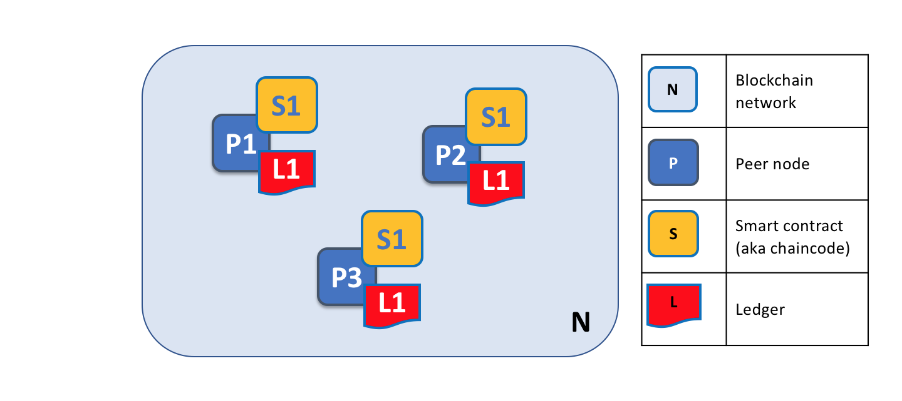
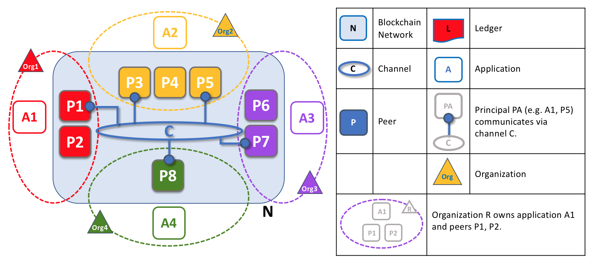
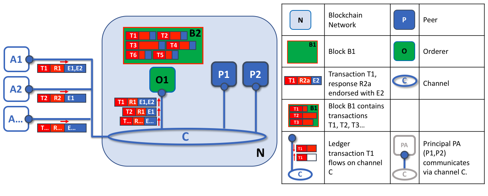

# 对等点（Peers）

区块链网络主要由一组 *peer nodes*（或者，简单地，*peers*）组成。
对等点是网络的一个基本元素，因为它们拥有分类帐和智能合同。
请记住，分类帐不可改变地记录由智能合约（或*链码*）生成的所有交易。
智能合约和分类帐用于分别封装网络中的共享*进程*和共享*信息*。
对等点的这些方面使它们成为理解Hyperledger Fabric网络的良好起点。

连锁网络的其他元素当然也很重要：分类账和智能合约、排序节点、策略、通道、
应用程序、组织、身份和成员资格，
您可以在他们自己的专用章节中了解更多关于它们的信息。本节集中在对等点上，
以及它们与超分类结构网络中的其他元素的关系。

*区块链网络由对等节点组成，每个节点都可以保存智能合约的分类帐和副本。
在这个示例中，网络N由对等点P1、P2和P3组成，每个对等点维护它们自己的分布式分类账L1的实例。
P1、P2和P3使用相同的链码S1来访问它们的分布式分类帐的副本*

可以创建、启动、停止、重新配置甚至删除对等点。
它们公开了一组API，使管理员和应用程序能够与它们提供的服务交互。
在本节中，我们将了解更多关于这些服务的内容。

### 术语

Hyperledger Fabric利用它称为**chaincode**的技术概念实现了智能合约---链码一段访问分类账的代码，
用支持的编程语言之一编写。在这个话题中，我们通常使用**chaincode**这个术语，
但是如果你更习惯这个术语，你可以把它看成是**智能合约（smart contract）**。这是一样的事情！

## 账本和链码

让我们来更详细地看看对等点。我们可以看到，它是同时拥有分类帐和链表的对等点。
更准确地说，对等点实际上承载了分类帐的*实例*和链码的*实例*。
请注意，这在Fabric网络中提供了故意冗余，它避免了单点故障。
我们将在本节稍后了解更多关于区块链网络的分布式和分散（distributed and decentralized）性质。

*对等点托管分类帐实例和链码实例。在这个例子中，P1承载了分类帐L1的实例和链码S1的实例。
可以有许多帐簿和链码托管在一个单独的对等点上。*

因为对等点是分类账和链表的*主机*，所以应用程序和管理员如果想要访问这些资源，必须与对等点交互。
这就是为什么对等点被认为是Hyperledger Fabric最基本的组成部分。
当对等点新创建时，它既没有分类帐也没有链表。稍后我们将看到如何创建帐簿，以及如何在同龄人上安装链码。

### 多重分类帐

对等点能够托管多个分类帐，这是有帮助的，因为它允许灵活的系统设计。
最简单的配置是对等点管理单个分类账，但是当需要时，对等点托管两个或多个分类账是绝对合适的。

*共享多个分类帐的对等点。对等点托管一个或多个分类帐，并且每个分类帐具有适用于它们的零个或多个链码。
在这个示例中，我们可以看到对等P1承载分类帐L1和L2。分类帐L1使用链表S1访问。
另一方面，可以使用链表S1和S2访问分类帐L2。*

虽然对等点完全可以托管分类账实例，而不托管访问该分类账的任何链码，但是很少以这种方式配置对等点。
绝大多数对等点将至少安装一个链码，该链码可以查询或更新对等点的分类账实例。
值得顺便提及的是，无论用户是否安装了供外部应用程序使用的链码，
对等点也具有始终存在的特殊**系统链码（system chaincodes）**。
这些在本主题中没有详细讨论。

### 多链码

对等点拥有的分类账数量与可以访问该分类账的链码的数量之间没有固定的关系。
对等点可能有许多链码和许多可用的分类帐。

*一个对等主机托管多个链表的例子。每个分类帐可以有许多链码来访问它。
在这个示例中，我们可以看到对等P1托管分类账L1和L2，其中L1由链表S1和S2访问，L2由S1和S3访问。
我们可以看到，S1可以同时访问L1和L2。*

稍后我们将看到为什么Hyperledger Fabric中的**通道**概念，
在托管对等点上的多个分类账或多个链码时很重要。

## 应用与对等点

现在我们将展示应用程序如何与对等点交互来访问分类帐。
分类账查询交互涉及应用程序和对等点之间的简单三步对话；
分类账更新交互稍微复杂一些，并且需要两个额外的步骤。
我们已经简化了这些步骤以帮助您开始使用Hyperledger Fabric，但是不用担心 ---
要理解的最重要的东西是：与分类账更新事务样式相比，用于分类账查询的application-peer交互的差异。

当应用程序需要访问分类帐和链码时，就会连接到它们。
Hyperledger Fabric Software Development Kit(SDK)使程序员很容易做到这点 ---
它的API使应用程序能够连接到对等点，调用链码来生成事务，将事务提交到网络，
该网络将被排序并提交到分布式分类账，以及当这个过程完成时接收事件。

通过对等连接，应用程序可以执行链码来查询或更新分类帐。
分类账查询事务的结果立即返回，而分类账更新涉及应用程序、对等点和排序节点之间更复杂的交互。
让我们更详细地研究这一点。

*对等题，与排序节点一起，确保分类帐在每个对等点上保持最新。
在这个例子中，应用程序A连接到P1并调用链表S1来查询或更新分类帐L1。
P1调用S1以生成包含查询结果或建议的分类帐更新的提案响应。
应用程序A接收提案响应，那么对于查询而言，整个过程就完成了。
对于更新，A从所有响应中构建交易，将其发送到O1进行排序。
O1从整个网络收集交易打包进块，并将这些块分配给所有的对等点，包括P1。
P1在应用到L1之前验证事务。一旦更新L1，P1生成一个事件，被A接收，以表示完成。*

对等点可以立即将查询结果返回给应用程序，因为满足查询所需的所有信息都在对等点的分类账的本地副本中。
对等点从不与其他对等点协商，以响应来自应用程序的查询。
然而，应用程序可以连接到一个或多个对等点以发出查询；
例如，在多个对等点之间确认结果，或者如果怀疑信息可能过时，则从不同的对等点检索更最新的结果。
在图中，您可以看到，分类帐查询是一个简单的三步过程。

更新事务启动的方式与查询事务相同，但有两个额外的步骤。
虽然分类账更新应用程序还连接到对等点以调用链码，但与分类账查询应用程序不同，
单个对等点此时不能执行分类账更新，因为其他对等点必须首先同意更改---称为 **共识（consensus）** 的过程。
因此，对等点将向应用程序返回**提议（proposed）**的更新 --- 该对等点将根据其他对等点的先前协议应用该更新。
第一个额外的步骤 --- 步骤4 ----要求应用程序向整个对等网络发送一组适当的匹配提议的更新，
作为对它们各自的分类账进行承诺的交易。
这是怎么实现的呢？是这样的，通过应用程序使用**排序节点**将事务打包成块，并将它们分发到整个对等网络，
在将它们应用于分类账的每个对等节点的本地副本之前，可以在该网络中对其进行验证。
由于整个排序处理需要一些时间来完成（几秒钟），因此应用程序被异步通知，如步骤5所示。

在本节后面的部分中，您将了解更多有关排序过程的详细性质的信息 --- 有关此过程的真正详细信息，请参阅
[Transaction Flow](../txflow.html) 主题。

## 对等点与通道

虽然本节是关于对等点而不是通道，但是值得花一点时间了解对等点如何通过通道与应用程序交互的，
*通道*是区块链网络中的一组组件可以*私下*进行通信和交易的机制。

这些组件通常是对等点、排序节点和应用程序，并且通过加入通道，
它们同意协作，从而共享和管理与该通道相关联的分类账的相同副本。
从概念上讲，您可以认为通道与朋友群体类似（尽管通道的成员当然不需要是朋友！）
一个人可能有好几组朋友，每个小组都有他们一起做的活动。
这些群体可能是完全分开的（一组工作朋友或者一组业余朋友），或者它们之间可能有一些交叉。
然而，每一个群体都是自己的实体，具有某种“规则”。

*通道允许一组特定的对等体和应用程序在区块链网络中相互通信。
在这个示例中，应用程序A可以使用通道C直接与对等点P1和P2通信。
可以将通道看作特定应用程序和对等点之间的通信路径。
（为了简单起见，在这个图中没有显示排序节点，但必须存在于功能网络中。）*

我们看到通道并不像对等点那样存在 --- 将通道看作由物理对等点集合形成的逻辑结构更合适。
理解这一点是至关重要的，*对等体提供了访问和管理通道的控制点*。

## 对等点和组织

现在，您已经了解了对等体及其与分类账、链码和通道的关系，
您将能够看到多个组织如何汇聚在一起以形成连锁网络。

区块链网络是由组织的集合而不是单个组织管理的。
对等点对于如何构建这种分布式网络至关重要，因为它们属于这些组织，并且是这些组织的网络连接点。

*具有多个组织的区块链网络中的对等体。区块链网络是由不同组织所拥有和贡献的对等体建立起来的。
在这个例子中，我们看到四个组织贡献八个对等体组成一个网络。
信道C在网络N --- P1、P3、P5、P7和P8中连接这些对等点中的五个。
这些组织拥有的其他对等方没有加入这个通道，但是通常至少加入另一个通道。
由特定组织开发的应用程序将连接到它们自己的组织的对等点以及不同组织的对等点。
同样，为了简单起见，在这个图中没有显示一个排序节点。*

看到在区块链网络的形成过程中发生了什么真的很重要。网络是由多个组织为其提供资源的组织和管理的。
对等点是我们在本主题中讨论的资源，但是组织提供的资源不仅仅是对等体。
这里存在一个原则 --- 如果没有组织将他们的个人资源贡献给集体网络，网络就根本不存在。
此外，网络随着这些协作组织提供的资源增长和缩小。

您可以看到（除了订购服务之外）没有集中的资源 --- 在 [example above](#Peer8)中，
如果组织不贡献它们的对等体，网络**N**将不存在。
这反映了这样一个事实，即：如果组织不贡献自己的资源来形成网络，网络将不会存在。
此外，网络不依赖于任何单个组织 --- 只要一个组织存在，它将继续存在，而不管其他组织来来去去。
这是网络分散的核心所在。

在不同组织中的应用，如 [example above](#Peer8)，可能是也可能不是相同的。
这是因为它完全取决于一个组织如何处理他们的对等点的分类账的副本。
这意味着，应用程序和表示逻辑可能因组织而异，即使它们各自的对等点托管完全相同的分类账数据。

应用程序根据所需的分类账交互的性质，要么连接到其组织中的对等点，要么连接到其他组织中的对等方。
对于分类帐查询交互，应用程序通常连接到它们自己的组织的对等体。
对于分类账-更新交互，我们将在后面看到，为什么应用程序需要连接到背书分类账更新所需的*每个*组织的对等体。

## 对等体与身份

现在，您已经了解了来自不同组织的对等点如何汇聚在一起以形成一个链式网络，
因此有必要花一些时间了解管理员如何将对等点分配给组织。

对等体具有通过特定证书颁发机构的数字证书分配给它们的身份。
您可以在本指南的其他地方阅读更多关于X.509数字证书如何工作的信息，
但是现在，可以将数字证书看作提供关于对等体的大量可验证信息的ID卡。
*网络中的每个对等点都由管理员从其拥有的组织中指派数字证书。*

*当对等体连接到通道时，其数字证书通过通道MSP标识其拥有的组织。
在这个例子中，P1和P2具有由CA1发出的身份。
通道C根据其通道配置中的策略确定来自CA1的标识应该使用ORG1.MSP与Org1相关联。
类似地，P3和P4由Org2.MSP识别为Org2的一部分。*

每当对等点使用通道连接到区块链网络时，*通道配置中的策略使用对等点的身份来确定其权限。*
身份到组织的映射由称为*成员服务提供者*（MSP）的组件提供——它确定对等点如何被分配到特定组织中的特定角色，
并因此获得对区块链资源的适当访问。
此外，对等体只能由单个组织拥有，因此与单个MSP相关联。
我们将在本节后面了解更多关于对等访问控制的信息，本指南中还有关于MSP和访问控制策略的整个部分。
但是现在，可以将MSP看作这样的角色，其在个体身份和区块链网络中的特定组织角色之间提供联系。

稍微离题一下，*对等点以及与区块链网络交互的所有内容都从它们的数字证书和MSP获得它们的组织标识。*
对等体、应用程序、最终用户、管理员和排序节点如果希望与块链网络交互，则必须具有标识和相关的MSP。
*我们给每个与区块链网络交互的实体使用一个身份 --- 一个主体 --- 来命名。*
你可以在这个指南中了解更多关于负责人（principals）和组织的知识，但是现在你已经知道了足够多的东西来继续理解对等点！

最后，请注意，对等点的物理位置并不重要——它可以驻留在云中，或者驻留在其中一个组织拥有的数据中心，
或者驻留在本地机器上 --- 与它相关联的身份标识它为某个特定组织所有。
在上面的示例中，P3可以托管在Org1的数据中心，但是只要与它相关联的数字证书由CA2颁发，那么它就属于Org2。

## 对等点和排序节点

我们已经看到，对等点构成了一个区块链网络的基础，它托管分类账和链码，
这些分类账和链码可以由peer-connected的应用程序查询和更新。
然而，应用程序和对等点之间进行交互，以确保每个对等点的分类账保持一致的机制是由称为*排序节点*的特殊节点中介的，
现在我们将注意力转向这些节点。

更新事务与查询事务非常不同，因为单个对等体不能单独更新分类账 --- 更新需要网络中其他对等体的同意。
对等体要求网络中的其他对等方在将其应用到对等方的本地分类帐之前，批准分类帐更新。
这个过程被称为*共识*，要比简单查询完成更长的时间。
但是，当需要批准事务的所有对等点都这样做，并且事务被提交到分类账时，对等点将通知其连接的应用程序分类账已经更新。
在这一节中，你将展示更多关于对等点和排序节点如何管理共识过程的细节。

具体地说，想要更新分类账的应用程序涉及到一个3阶段的过程，
这确保了区块链链网络中的所有对等体保持它们的分类帐彼此一致。
在第一阶段，应用程序与*背书节点（endorsing peers）*的子集一起工作，
每一个都为应用程序提供所提议的分类帐更新的背书，但不将建议的更新应用到其分类帐的副本。
在第二阶段，这些单独的背书作为交易被收集在一起并打包成块。在最后阶段，这些块被分发回每个对等点，
每个事务在被应用到该对等者的分类帐副本之前被验证。

正如您将看到的，排序节点是这个过程的核心，
因此让我们更详细地研究应用程序和对等点如何使用排序服务来生成分类账更新，
这些更新可以一致地应用于分布式、复制的分类账。

### 第1阶段：提案

交易工作流程的第一阶段涉及应用程序和一组对等点之间的交互 --- 它不涉及排序节点。
阶段1只涉及一个应用程序，该应用程序要求不同组织的背书对等方同意所提议的链码调用的结果。

为了开始阶段1，应用程序生成一个事务建议，并将其发送到每个所需的对等点集合进行背书。
然后，这些背书对等体中的每一个都使用交易提案独立执行链码以生成交易提案响应。
它不将此更新应用于分类账，而是简单地将其签名并返回给应用程序。
一旦应用程序收到足够数量的已签名的提案响应，事务流程的第一阶段就完成了。
让我们更详细地检查这个阶段。

*交易提案由返回背书提案相应的peer独立执行。
在此示例中，应用程序A1生成事务T1建议P，并将其发送到信道C上的对等点P1和对等点P2。
P1使用交易T1提案P执行S1，生成交易T1响应R1，它用E1认可。
与此同时，P2使用交易T1提案P执行S1，生成事务T1响应R2，该交易T1响应R2用E2认可。
应用A1接收事务T1的两个认可响应，即E1和E2。*

最初，由应用程序选择一组对等体来生成一组提议分类帐更新。
哪些节点是由应用程序选择的？嗯，这取决于*背书策略*（为链码所定义），
它定义了一组组织，这些组织需要在账本更改被网络接受之前，对账本更改进行背书。
这就是达成共识的真正含义 --- 每一个重要的组织都必须背书提议议的分类账变更，
*然后*才会被所有peer的分类账接受。

对等体通过添加其数字签名来认可提案响应，并使用其私钥签署整个有效载荷（payload）。
这种背书随后可以用来证明这个组织的peer产生了特定的反应。
在我们的示例中，如果对等点P1属于Org1组织，
则背书E1对应于这样一个数字证明，即“分类账L1上的事务T1响应R1，已经由Org1的对等点P1提供！”。

当应用程序从足够的对等体接收签名的提案响应时，第1阶段结束。
我们注意到，*对于相同的交易提案*，不同的对等体可以向应用程序返回不同且因此不一致的交易响应。
它可能只是在不同的时间用不同状态的分类账在不同的对等体上生成结果，
在这种情况下，应用程序可以简单地请求更加新的提案响应。
虽然不太可能，但更严重的是，结果可能是不同的，因为链码是非确定性的。
不确定性是分类账和分类账的敌人，如果出现不确定性，则表明所提议的交易存在严重问题，
因为不一致的结果显然不能应用于分类账。
单个对等点无法知道他们的交易结果是非确定性的 --- 在检测到非确定性之前，必须将交易响应收集在一起进行比较。
（严格地说，这样还不够，但我们将讨论推迟到交易部分，在那里详细讨论不确定性。）

在阶段1的末尾，如果应用程序希望丢弃不一致的交易响应，那么它可以自由地丢弃不一致的交易响应，
从而提前有效地终止交易工作流。稍后我们将看到，
如果应用程序试图使用一组不一致的交易响应来更新分类账，那么它将被拒绝。

### 阶段2：打包

交易工作流的第二阶段是打包阶段。排序节点是这个过程的关键 ---
它从许多应用程序接收包含被背书的交易建议响应的交易。它对每个事务进行排序，并将成批的交易打包成块，
准备分发回与排序节点连接的所有对等体，包括原始背书对等体。

*排序节点的第一个作用是包装提案的分类帐更新。
在这个例子中，应用程序A1向排序节点O1发送由E1和E2背书的交易T1。于此同时，应用程序A2将由E1认可的事务T2发送给排序节点O1。
O1将来自应用程序A1的事务T1和来自应用程序A2的事务T2以及来自网络中其他应用程序的其他事务打包到块B2中。
我们可以看到，在B2中，事务顺序是T1、T2、T3、T4、T6、T5，这可能不是这些交易到达排序节点的顺序！
（这个例子显示了一个非常简化的排序节点配置。）*

排序节点从许多不同应用程序接收提案的账本数据更新，这些应用程序都在特定通道上的网络中。
它的工作是将这些提案的更新安排成一个定义良好的序列，并将它们打包成*区块*以供后续分发。这些块将成为区块链的*区块*！
一旦排序节点生成了所需大小的块，或者在经过最大时间之后，它将被发送到在特定通道上连接到它的所有对等方。
我们将看到这个块是如何在第3阶段处理的。

值得注意的是，区块中交易的顺序不一定与事务到达排序节点的顺序相同！
交易可以按任意顺序打包成一个块，并且这个序列将成为执行顺序。
重要的是**有一个**严格的秩序，而不是那个秩序**是什么**。

块内交易的严格排序使得Hyperledger Fabric与其他区块链链略有不同，在其他区块链中相同的事务可以打包成多个不同的块。
在Hyperledger Fabric中，这不可能发生。
由排序节点集合生成的块被称为**最终**块，因为一旦交易被写到区块中，它在分类账中的位置就不可改变。
超分类帐的最终确定性意味着一种叫做**账本分叉**的灾难性的发生不能发生。
一旦在块中捕获交易，就不能在将来的时间点为该交易重写历史记录。

我们也可以看到，虽然peer主宰了账本和链码，但排序节点肯定不这样做。
到达排序节点的每个交易都被机械地打包在一个块中。
排序节点不判断交易的价值，它只是打包它。
这是Hyperledger Fabric的一个重要特性，所有的交易都被编组成一个严格的顺序，交易从不被丢弃或取消优先级。

在阶段2的末尾，我们看到排序节点负责以下这些简单而重要的过程：
收集提案的事务更新、给他们排序、将它们打包成块、准备分发。

### 阶段三：验证

交易工作流程的最后阶段，涉及从排序节点到peer的块的分发和随后的验证，这样可以将它们应用于分类账。
具体而言，在每个peer上，对块内的每个交易进行验证，以确保在应用于账本之前，它始终得到所有相关组织的背书。
事务被保留下来用于审计，但不应用于分类帐。

*排序节点的第二个作用是将块分配给peer在这个例子中，排序节点O1将块B2分配给peer P1和peer P2。
peer P1 处理 B2，导致新的块被添加到P1上的分类帐L1。
与此同时，peer P2 处理块 B2，导致新的块被添加到P2上的分类帐L1。
一旦该过程完成，分类账L1已经在peer P1和P2上一致地更新，并且他们都可以通知连接的应用程序事务已经被处理。*

阶段3开始于排序节点分发块到连接到它的所有peer。
peer连接到通道上的排序节点，以便当生成新块时，连接到排序节点的所有peer都将收到新块的副本。
每个对peer将独立地处理该区块，但与通道上的每个peer完全相同。这样，我们就会发现分类帐可以保持一致。
还值得注意的是，并非每个对等体都需要连接到排序节点，对等体可以使用 **gossip** 协议将区块级联到其他peer，
这些peer也可以独立地处理它们。但是让我们把稍后讨论这个！

在接收到一个块后，peer将按其出现在块中的顺序处理每个交易。
对于每个交易，每个peer将根据生成交易的链码的 *背书策略*，来验证交易是否已由所需组织认可。
例如，一些交易可能只需要由单个组织进行背书，而另一些事务可能需要多次背书才能被认为是有效的。
这个验证过程验证了所有相关组织都产生了相同的结果或结果。
还请注意，此验证不同于阶段1中的背书检查，其中应用程序接收来自背书节点的响应并决定发送交易提案。
如果应用程序通过发送错误的交易违反了背书策略，那么在阶段3的验证过程中，peer仍然能够拒绝事务。*

如果交易被正确地背书，peer将尝试将其应用于分类帐。
为此，peer必须执行分类账一致性检查，以验证在生成交易的更新时，分类账的当前状态与分类账的状态兼容。
即使交易被完全认可，这也未必总是可行的。
例如，另一个交易可能已经更新了分类账中的相同资产，使得交易更新不再有效，因此不能再应用。
通过这种方式，分类账的每个pper的副本在网络上保持一致，因为它们每个都遵循相同的验证规则。

在peer成功地验证了每个单独的交易之后，它更新了分类帐。
失败的交易不适用于分类帐，但它们是为了审计目的而保留的，如同成功的交易一样。
这意味着peer区块几乎与从排序节点接收的块完全相同，只是块中的每个交易上有一个有效或无效的指示符。

我们还注意到，阶段3不需要运行链码——这只在阶段1期间完成，这很重要。
这意味着链码只需要在背书节点上可用，而不必在整个区块链网络中使用。
这通常是有益的，因为它将链码的逻辑机密保留在了背书组织里。

这与通道中的每个peer共享的链码（事务建议响应）的输出形成对比，无论它们是否背书事务。
支持背书节点的这种专门化旨在帮助扩展性。

最后，每当一个区块被提交给一个peer的分类帐时，该peer就会生成一个适当的*事件*。
*区块事件（block events）* 包括完整的块内容，
而 *区块交易事件（block transaction events）* 仅包括摘要信息，例如块中的每交易是否已被验证或无效。
链码执行所产生的*链码*事件也可以在此时发布。
应用程序可以注册这些事件类型，以便在发生事件时可以通知它们。
这些通知结束了交易工作流的第三阶段和最后阶段。

总而言之，阶段3看到由排序节点始终如一地应用到分类帐中产生的块。事务的严格排序

总而言之，阶段3看到由排序节点生成的块，持续不断始终如一地应用到分类帐。
将交易严格排序区块块，允许每个peer验证交易更新是否一致地应用于整个区块链网络。

### 排序节点与共识

整个交易工作流过程被称为*共识*，因为所有peer在排序节点的介入下，对交易的顺序和内容达成了一致。
共识是一个多步骤的过程，应用程序只在处理完成时通知分类帐更新，这可能在不同的时间点上发生在不同的peer上。

我们将在未来的排序节点主题中更详细地讨论排序节点，
但现在，将排序节点当作这样的节点，收集和分发来自peer的应用程序提出的分类帐更新，以验证和包括在分类帐上。

就是这样！现在我们完成了peer和其他与Hyperledger Fabric相关的组件的访问。
我们已经看到，peer在很多方面是最基本的元素，它们构成网络、主机链码和分类帐，处理交易提案和响应，
并通过不断地向其应用交易更新来保持分类帐最新。

<!--- Licensed under Creative Commons Attribution 4.0 International License
https://creativecommons.org/licenses/by/4.0/) -->
